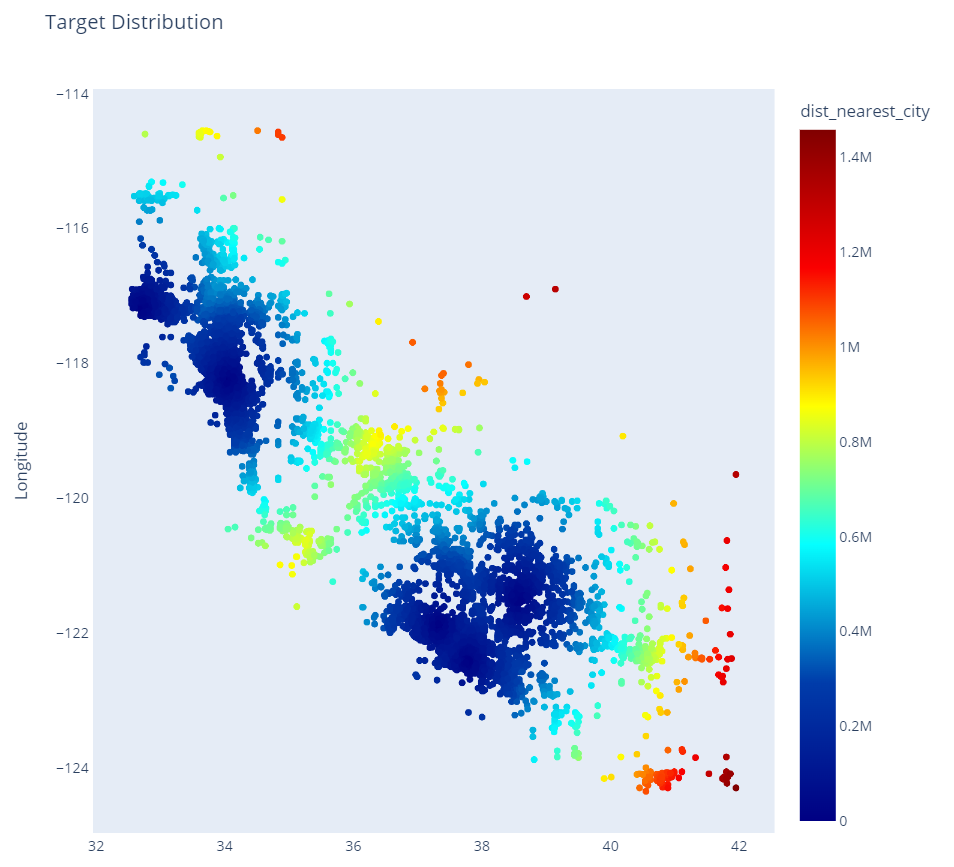
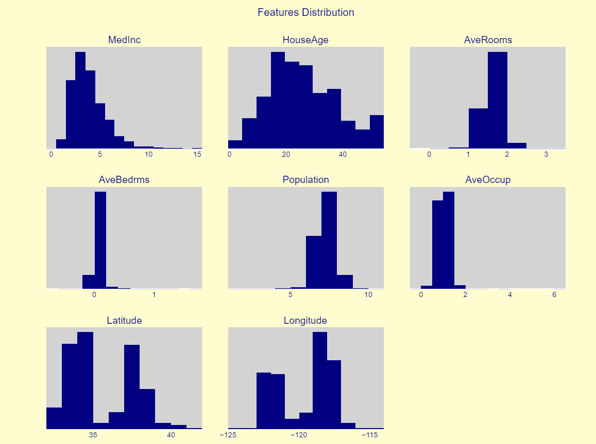

# Background

This is a Machine Learning Project via Kaggle. The goal is to predict housing prices based on input features.

# Method

Used LGBM. Also tried stacking and catboost but didn't work as well.

# Score 

Public score of 0.5800, (ranked 492 out of 689) (Entered too late so couldn't submit to leaderboard).

Competition found here: https://www.kaggle.com/c/playground-series-s3e1
